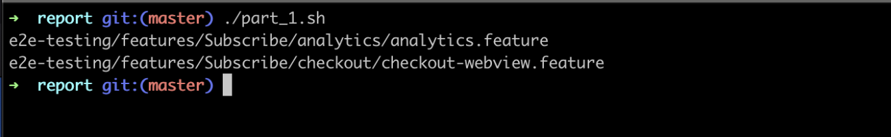

# Dojo 1

## Intro

This Dojo is to practice some command line saw during the first meeting. Create a script that you will improve at each iteration.
The script need to be executed on the same folder as the current Readme. Data that you need to analyse are in the datas folder.

## Part 1

Create a script bash that will find all files who contains skipped tests (tip: the annotation for that is *@skip*)

## Part 2

Improve the previous script to display the Feature that contains skipped scenarios and how many.

## Part 3

Improve the previous script to also display the name of Scenario skipped per Feature and save the result inside a file named 'result'.

